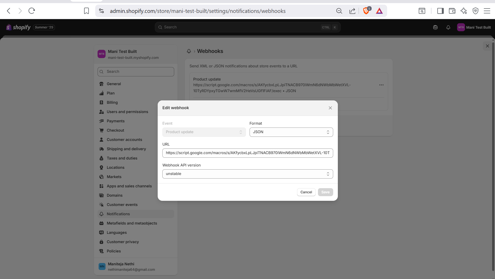
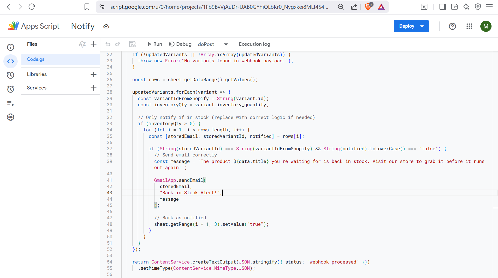
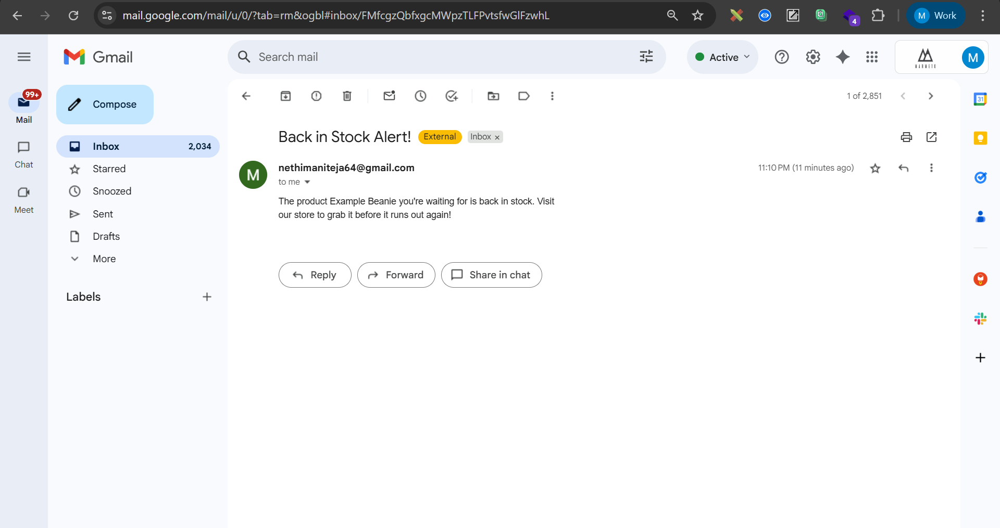

Bonus Task – Back-in-Stock Notification Flow Using Shopify Webhooks + Email API
This feature enables customers to subscribe for notifications when a product variant is back in stock. The flow is built using Shopify Webhooks, Google Sheets, and Google Apps Script.

🛒 Shopify Webhook Configuration
A "Product Update" webhook is configured in Shopify. It triggers automatically whenever there’s a change in product or variant data — including inventory updates.

📩 Notify Me Button (Frontend)
On the product page, if a variant is out of stock, a “Notify Me” button is displayed. When clicked:
An input field appears for the customer to enter their email.
On submission, the customer’s email and variant ID are stored in a connected Google Sheet.

[Google sheet link](https://docs.google.com/spreadsheets/d/11KTNVL-8WxZtSwm77nULfzyFri74CInGJXOLIMgJ0oc/edit?gid=0#gid=0)

⚙️ App Script Logic (Backend)
When the webhook fires due to inventory changes:
The Google Apps Script linked to the sheet processes the incoming payload.
It checks each variant's inventory change.
If any variant's inventory transitions from 0 to >0, it:
Looks up matching entries in the sheet
Sends a Back-in-Stock email to those customers
Marks them as "notified" to prevent duplicate emails

📧 Sample Email Notification
Customers receive a simple email when the product is restocked:

🔗 Test Product Example
You can test this flow using the following product that is currently out of stock:

Product link that is in out of stock is : https://mani-test-built.myshopify.com/products/example-hat

Key files : snippets/buy-buttons.liquid, global.js