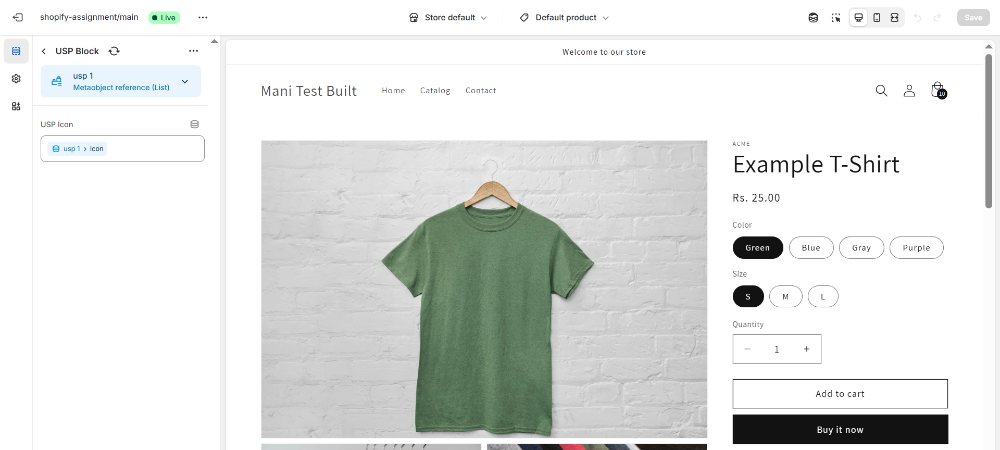
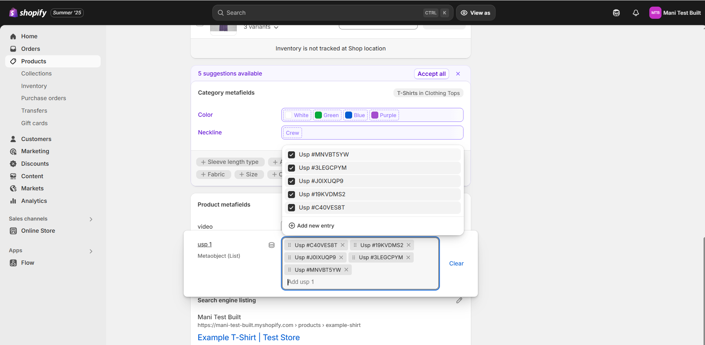
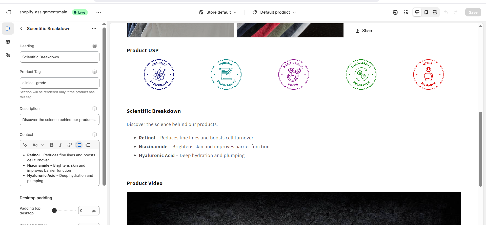
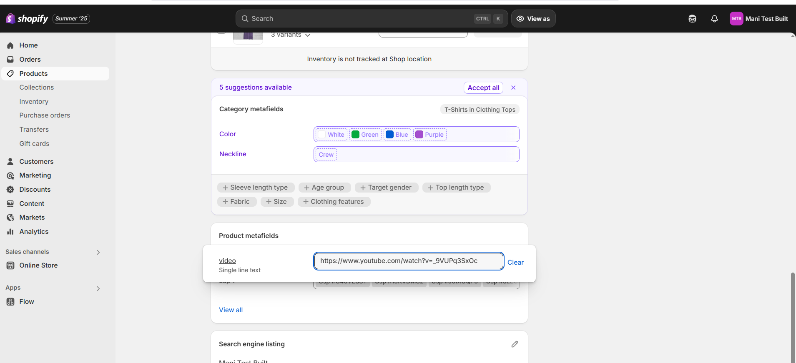
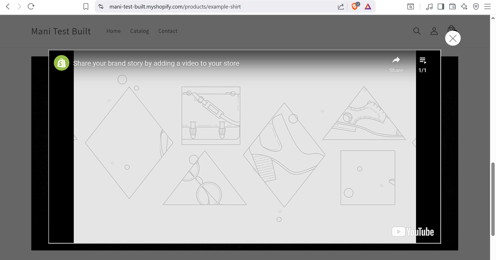

Task 2 – Dynamic PDP Sections (Metafield & Tag-Based Rendering)
This task implements three custom, modular sections on the product page that appear conditionally based on product metafields or tags. All sections are lazy-loaded to improve performance and reduce initial DOM load.

🔹 Section 1: Product USP
Renders only if the product has a metafield value for product.usp_1

The USP data and icons are configured via the theme customizer

Metafield product.usp_1 is used to dynamically insert one line of text into a reusable USP section

Customizer Preview:

Metafield Configuration:

📁 Key File:
sections/custom-usp.liquid

🔹 Section 2: Scientific Breakdown
Renders only if the product has a specific tag

The tag can be customized in theme settings (currently using clinical-grade)

This section displays a visually enhanced breakdown of clinical/scientific ingredients

Tag-based Customizer:

📁 Key File:
sections/custom-scientific-breakdown.liquid

🔹 Section 3: Product Video
Renders only if the product has a product.video metafield

Displays a thumbnail or CTA, which opens a custom modal on click

Video content is embedded via YouTube or similar source

Customizer Settings:

Video Modal UI:

📁 Key File:
sections/custom-video.liquid

🌀 Lazy Loading Behavior
All three sections are not rendered on initial DOM load. Instead, they are injected dynamically when the page is scrolled within ~100px of each section’s position.

📁 Lazy Load Script:
assets/global.js