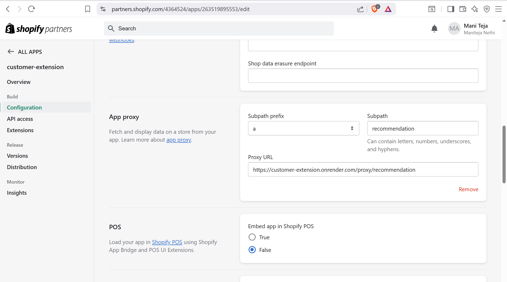
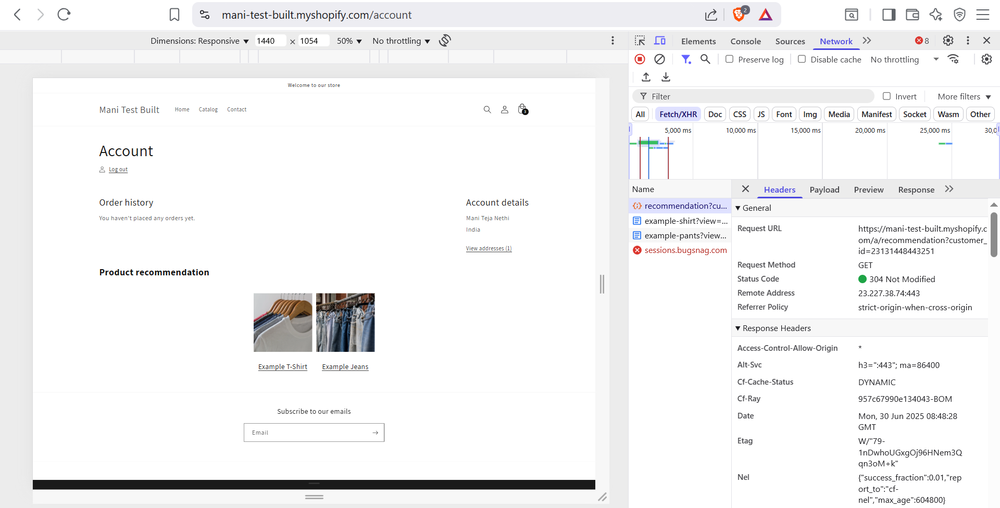

Task 3 – App Proxy + Private API Hook (Personalized Recommendations)
This task demonstrates how to connect a Shopify App Proxy to a custom backend API that simulates personalized product recommendations based on customer-specific data.

🧱 App Proxy Configuration
Created a custom app named customer-extension using the Shopify CLI

App Proxy is configured to route requests from:

https://mani-test-built.myshopify.com/a/recommendation ➡ to the backend URL: https://customer-extension.onrender.com/proxy/recommendation

📸 App Proxy Setup:

🖥️ Backend & Mock API Setup
Backend is built using Node.js + Express and hosted for free on Render

The server simulates an external API call by internally calling a /mock-api/customer-profile route

Recommendation logic is mocked using hardcoded customer_id → product mappings

📁 Backend Code Repo:
[🔗 customer-extension/server.js](https://github.com/Nethimaniteja/customer-extension/blob/main/server.js)

Note: Due to cold starts on free hosting, the first hit to the Render server may fail — it responds successfully on subsequent requests.

👤 Customer Account Integration
When a logged-in customer visits their account page, the custom element <customer-recommendation> is triggered.

Account login credentials : 
Email : nethimaniteja64@gmail.com
Password : nethimaniteja64@gmail.com

It fetches personalized recommendations using the App Proxy URL

📸 Account Page Network Request:

🧪 Simulated / Mocked Behavior
Customer data (e.g. quiz results, order history) is mocked — there is no real external data source

customer_id is hardcoded in the backend for demonstration.

📁 Key Files
assets/global.js
sections/main-account.liquid